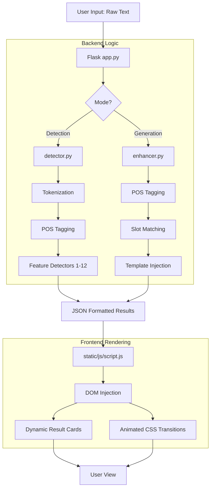

# Figure of Speech Detector & Poetic Generator: Technical Deep Dive

This document provides a comprehensive breakdown of the NLP concepts utilized in this project, mapping them to specific features, algorithmic logic, and code locations.

## 1. NLP Concepts & Feature Mapping

| Concept Name | Used in Features | Logic (Why used) | File | Line Range |
| :--- | :--- | :--- | :--- | :--- |
| **Tokenization** | All Detection & Generation | Necessary to split raw paragraph text into individual sentences and words for granular analysis. | `detector.py` | 62, 66 |
| **Part-of-Speech (POS) Tagging** | Metaphor, Personification, Transferred Epithet | Allows the computer to understand the grammatical role (Noun, Verb, Adjective) of each word to identify structural patterns. | `detector.py` | 67 |
| **Regex-Based Pattern Matching** | Simile, Alliteration, Sarcasm | Captures structural string sequences (like `as...as` or `like a...`) that signify figurative language. | `detector.py` | 73-74, 153, 221 |
| **Lexical Analysis** | Hyperbole, Oxymoron, Idiom | Cross-references word tokens against curated dictionaries of known figurative markers and contradictory pairs. | `detector.py` | 121, 142, 178, 192 |
| **Basic Syntactic Pattern Recognition** | Metaphor, Personification | Identifies specific POS tag sequences (e.g., Noun followed by "Be" verb followed by metaphorical target). | `detector.py` | 92-96, 110 |
| **Discourse-Level Repetition Detection** | Anaphora | Analyzes the beginning of consecutive clauses or sentences to find identical multi-word prefixes. | `detector.py` | 268-312 |
| **Lexical Semantics** | All Dictionaries | Assigns figurative meaning by grouping words into semantic classes (e.g., "inanimate targets", "human verbs"). | `detector.py` | 90, 107, 250 |
| **Paragraph-level Mapping** | Enjambment | Tracks the flow of text across vertical line-break boundaries (`\n`) to identify incomplete punctuation. | `detector.py` | 315-332 |
| **Fuzzy String Matching** | Simile (Self-comparison) | Uses the Gestalt Pattern Matching algorithm (`difflib`) to prevent comparing a word to itself (e.g., "coffee like coffee"). | `detector.py` | 22-56 |
| **Template-based Text Generation** | Poetic Enhancer | Maps identified adjectives/nouns to pre-written poetic templates to "rewrite" sentences poetically. | `enhancer.py` | 16-120, 164-240 |
| **Non-deterministic Heuristics** | Poetic Enhancer (Randomization) | Uses randomized weights (e.g., `random.random() > 0.3`) to determine where and which poetic devices are injected to ensure unique outputs. | `enhancer.py` | 164, 210, 221, 260 |

---

## 2. Additional NLP Concepts Used
Beyond the list provided, the project also utilizes:
- **Stopword Filtering:** Used during fuzzy matching to ignore common words (like "the", "a") when comparing similarity. (`detector.py` line 33).
- **Bigram/Trigram Analysis:** Used in structural checks where sequences of 2 or 3 adjacent tokens are analyzed together. (`detector.py` lines 91, 109, 253).

---

## 3. Project Architecture Diagram

The flow of data through the Figure of Speech Detector and Generator follows a structured Pipeline:

---

## 4. Detailed Component Breakdown

### A. `detector.py` (The Analysis Engine)
Used in **Detector Mode** to identify and explain figures of speech in real-time.

| Section | Code Lines | Purpose & Logic |
| :--- | :--- | :--- |
| **Setup & Pre-fetching** | 1 - 13 | Imports dependencies and ensures the local environment has necessary NLP datasets (punkt, averaged_perceptron_tagger). |
| **Utility Logic** | 15 - 56 | Contains `highlight_context` for UI marking and `is_self_comparison` which filters out literal comparisons via fuzzy matching. |
| **Tokenization & Tagging** | 61 - 67 | Initial pass using `nltk` to break the input into manageable grammatical chunks for analysis. |
| **Detector Dictionaries** | 90, 107, 121, etc. | Stores specialized keyword lists (inanimate nouns, human verbs, etc.) used as triggers for detection. |
| **Detection Modules** | 69 - 332 | Twelve distinct algorithmic blocks (Regex, POS-Bigrams, Loop-matchers) each dedicated to a specific Figure of Speech. |
| **Deduplication Engine** | 334 - 345 | Ensures that overlapping regex matches are filtered so users receive unique and clean result cards. |

### B. `enhancer.py` (The Generation Engine)
Used in **Generator Mode** to transform standard prose into evocative poetry.

| Section | Code Lines | Purpose & Logic |
| :--- | :--- | :--- |
| **Poetic Dictionaries** | 15 - 120 | Vast mapping of adjectives and nouns to multi-phrase poetic templates (e.g., "bright" -> "like a flare in the night"). |
| **Validation Layer** | 128 - 137 | Enforces the "Rule of Six"—a logical constraint requiring at least 6 lines of text to maintain poetic context. |
| **Injection Engine** | 143 - 258 | The primary loop that identifies grammatical "slots" (Parts of Speech) and swaps or appends them with poetic variants. |
| **Rhythmic Anaphora** | 260 - 271 | Adds structural repetition phrases specifically to the concluding lines for rhythmic consistency. |
| **Modification Logger** | 273 - 281 | Compiles a "Before & After" history so the UI can explain exactly what was changed and why. |

---

## 5. Work Flow Summary
1.  **Input:** User enters text in the glassmorphic interface.
2.  **Routing:** `script.js` sends an asynchronous `fetch` request to the Flask server (`app.py`).
3.  **Processing:** 
    - In **Detector Mode**, `detector.py` breaks the text down and returns every captured figure of speech with an "Algorithm Logic" explanation.
    - In **Generator Mode**, `enhancer.py` identifies "slots" for poetic improvement and injects random figurative tropes.
4.  **Display:** The results are parsed by the frontend and displayed as vibrant, category-colored "Cards" that highlight the specific text segment found or modified.
